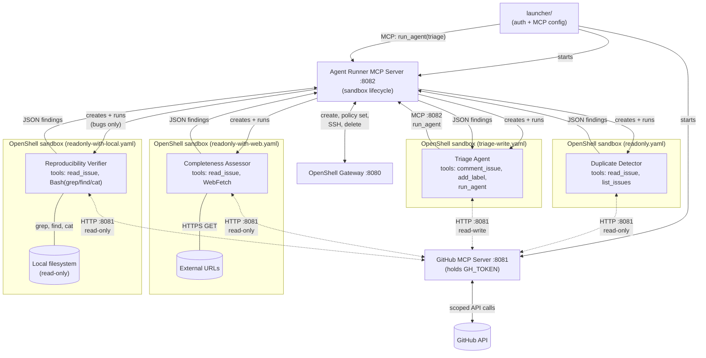

# PoC FullSend — Triage Agents with scoped tools and sandbox

This experiment addresses: https://github.com/fullsend-ai/fullsend/issues/101

Counterpart to [experiment 67](../67-claude-github-app-auth/) which demonstrates the wrapper/pure-I/O approach. This experiment demonstrates an alternative using established patterns from [Claude Code](https://code.claude.com/docs/en/skills) and [OpenCode](https://opencode.ai/docs/skills/): **skills define capabilities, agents execute them with scoped tools, and a top-level agent orchestrates the flow.**

### What this experiment covers

- **Agent-driven orchestration**: A top-level agent spawns subagents dynamically based on a prompt and available tools — it decides which subagents to invoke, in what order, and whether to skip steps based on context.
- **Every agent is sandboxed**: Both the orchestrator and every subagent run inside their own [OpenShell](https://github.com/NVIDIA/OpenShell) sandbox. No agent runs unsandboxed.
- **Tools are scoped per agent via skills**: Each agent has access only to the tools its skill declares. Subagents get read-only tools; only the orchestrator has write tools. This is enforced at both the runtime level (agent/skill definitions) and the infrastructure level (sandbox policies).
- **Sensitive tokens are isolated from agents**: The GitHub token lives exclusively in the GitHub MCP server process — agents never see `GH_TOKEN` in their environment. They interact with GitHub only through MCP tools, which validate every request. Even if an agent is compromised, it has no credential to exfiltrate.
- **Per-agent sandbox guardrails covering filesystem and network**: Each sandbox has a tailored policy that restricts both filesystem access (read-only vs. read-write paths) and network egress (which hosts, ports, HTTP methods, and API paths are allowed). The orchestrator can POST comments; subagents can only GET. One subagent can fetch external URLs; another can read the local filesystem; the rest have no access to either.

## Concepts

### Skills
A **skill** is a reusable capability definition: a prompt and a set of allowed tools. Skills define *what* to do, not *how* to execute it. They live as `SKILL.md` files following the [Agent Skills](https://agentskills.io) open standard.

### Agents
An **agent** is an execution context that uses one skill. It defines *how* to run: which model, which MCP servers, which tools, what permissions. Each agent does one job.

### Top-level agent
A top-level agent orchestrates subagents. It has its own tools (in this case, write tools for commenting and labeling) and decides which subagents to invoke and in what order based on context. This gives flexibility — the top-level agent can skip steps, change order, or adapt based on findings.

## Architecture



Each agent runs in its own OpenShell sandbox with a tailored network policy. The sandbox enforces at the infrastructure level what the runtime tool scoping enforces at the application level — defense in depth.

## File structure

```
experiments/101-agent-scoped-tools/
├── README.md
├── requirements.txt
├── launcher/                                # Python package — run with: python -m launcher
│   ├── __init__.py                          # Shared constants (ports)
│   ├── __main__.py                          # CLI entry point (argparse)
│   ├── auth.py                              # GitHub token acquisition helpers
│   └── orchestrator.py                      # Starts MCP servers, launches triage via agent runner
├── skills/
│   ├── triage-coordination/SKILL.md         # Skill: orchestrate triage flow
│   ├── detect-duplicates/SKILL.md           # Skill: find duplicate issues
│   ├── assess-completeness/SKILL.md         # Skill: evaluate issue quality + fetch external links
│   └── verify-reproducibility/SKILL.md      # Skill: check bug reproducibility
├── agents/
│   ├── triage.md                            # Top-level agent (orchestrator + writes)
│   ├── duplicate-detector.md                # Subagent using detect-duplicates skill
│   ├── completeness-assessor.md             # Subagent using assess-completeness skill
│   └── reproducibility-verifier.md          # Subagent using verify-reproducibility skill
├── policies/
│   ├── triage-write.yaml                    # OpenShell policy: read + write issues
│   ├── readonly.yaml                        # OpenShell policy: read-only GitHub API
│   ├── readonly-with-web.yaml               # OpenShell policy: read-only + HTTPS GET anywhere
│   └── readonly-with-local.yaml             # OpenShell policy: read-only + local filesystem
└── tools/
    ├── gh-mcp/
    │   └── gh_mcp_server.py                 # GitHub MCP server: holds token, exposes scoped tools
    └── agent-runner/
        ├── agent_runner_mcp_server.py       # Agent runner MCP server: entry point + HTTP handler
        ├── runner.py                        # Agent runner: sandbox lifecycle for all agents
        └── sandbox.py                       # OpenShell primitives (create, delete, policy, SSH, SCP)
```

## How it works

1. **`launcher/`** authenticates as a GitHub App, generates a repo-scoped token, starts two MCP servers (GitHub tools on `:8081` and agent runner on `:8082`), and launches the triage agent via the agent runner in its own OpenShell sandbox
2. **The triage agent** reads the issue, then decides which subagents to invoke via the `run_agent` MCP tool:
   - Always runs **duplicate-detector** and **completeness-assessor**
   - Runs **reproducibility-verifier** only for bug reports
   - Can skip checks if a high-confidence duplicate is found
3. **Each subagent** is created by the agent runner MCP server in a fresh sandbox with its own policy, runs with read-only tools, and returns structured findings
4. **The triage agent** collects findings, applies labels, and posts a triage summary comment

The top-level agent is the only one with write tools (`comment_issue`, `add_label`). Subagents can only read. This enforces a clear separation: subagents analyze, the orchestrator acts.

## Key design decisions

### Skills are portable
Skills follow the [Agent Skills](https://agentskills.io) open standard. The same `SKILL.md` works in Claude Code, OpenCode, or any compatible runtime. They define *what* to do without coupling to a vendor.

### One agent, one skill
Each subagent performs exactly one skill. This keeps agents focused, makes them independently testable, and allows organizations to override specific agents without affecting others.

### Top-level agent is flexible
Unlike a declarative pipeline, the top-level agent (an LLM) decides the order and whether to skip steps. It can adapt: if duplicate detection returns high confidence, it may skip completeness assessment. This flexibility is the value of having an agent as orchestrator.

### Subagents only read, orchestrator writes
Subagents have read-only tools and return JSON. Only the top-level agent has write tools (`comment_issue`, `add_label`). This means:
- A compromised subagent can't write to the issue
- Write logic is centralized and auditable
- The triage comment format is controlled by one agent

### GitHub MCP server holds credentials
The token lives in the GitHub MCP server process. Neither the top-level agent nor subagents have `GH_TOKEN` in their environment. They interact with GitHub exclusively through MCP tools, which validate every request.

## Key differences from experiment 67

| Aspect | Experiment 67 (wrapper) | This experiment (scoped tools) |
|--------|------------------------|-------------------------------|
| Agent has GH_TOKEN | Yes (in env) | No |
| Who writes to GitHub | Agent (unrestricted) | Top-level agent only (scoped tools) |
| Agent structure | Single LLM call | Top-level agent + subagents |
| Subagent capabilities | N/A | Read-only, one skill each |
| Orchestration | N/A | Top-level agent decides flow |
| Skill portability | N/A | Standard SKILL.md format |
| Customization per org | Rewrite prompt | Override specific skills/agents |

## Usage

```bash
pip install -r requirements.txt

python -m launcher \
  --pem /path/to/app.pem \
  --client-id YOUR_CLIENT_ID \
  --installation-id 12345 \
  --repo org/repo \
  --issue 42
```

## Compatibility

The file formats follow Claude Code conventions (the stricter of the two) with notes on OpenCode differences.

### Skills (`SKILL.md`)

| Feature | Claude Code | OpenCode |
|---------|-------------|----------|
| `name` | Supported | Supported |
| `description` | Supported | Supported |
| `allowed-tools` | Supported (scopes tools when skill is active) | Not supported (tool scoping is done at agent level) |
| Markdown body | Skill instructions | Skill instructions |
| Directory structure | `.claude/skills/<name>/SKILL.md` | `.opencode/skills/<name>/SKILL.md` |

### Agents (`.md` files)

| Feature | Claude Code | OpenCode |
|---------|-------------|----------|
| `name`, `description` | Required | Required |
| `tools` | Comma-separated string | Configured via `permission` object |
| `model` | `sonnet`, `haiku`, `opus`, or full ID | `provider/model-id` format |
| `skills` | List of skill names preloaded into context | Not in agent frontmatter (agents invoke skills via tool) |
| `Agent(name, ...)` in tools | Restricts which subagents can be spawned | Not supported (uses Task tool) |
| `mcpServers` | Inline or reference by name | Not supported in agent frontmatter |

### What this means in practice

- **Skills** are fully portable between both runtimes. The `allowed-tools` field is a no-op in OpenCode but doesn't break parsing.
- **Agent definitions** use Claude Code format. To use with OpenCode, the `tools` field would need to be translated to OpenCode's `permission` object, and `skills` would need to be invoked via the skill tool rather than preloaded.
- **MCP servers** (`tools/gh-mcp/gh_mcp_server.py` and `tools/agent-runner/agent_runner_mcp_server.py`) are runtime-agnostic — they support both stdio and HTTP transport. In sandboxed mode, they run as HTTP servers on the host and agents connect via `host.docker.internal`.

## Security layers

**Skill-level (capability scoping):**
- Each skill declares its allowed tools
- Subagents can only use the tools their skill permits
- Skills are reviewed and version-controlled

**Agent-level (execution isolation):**
- Each subagent runs in clean context (no leaking between subagents)
- Subagents have read-only tools — cannot write to issues
- Only the top-level agent has write tools
- Subagents are invoked via the agent runner MCP server which creates each in its own OpenShell sandbox

**GitHub MCP server (credential isolation):**
- Token lives only in the GitHub MCP server process
- Tools validate target repo matches the allowed repo
- Credential scanning on comment bodies before posting

**Sandbox (infrastructure enforcement):**
- Agent processes have no `GH_TOKEN` in their environment
- Network egress restricted to the MCP HTTP server on the host (`host.docker.internal:8081`)
- Even if an agent bypasses MCP tools, it has no token to authenticate

## Per-agent sandboxing with OpenShell

Each agent runs in its own [OpenShell](https://github.com/NVIDIA/OpenShell) sandbox with a tailored network policy. The `sandbox` field in each agent's definition points to its policy file — the agent definition is the single source of truth.

The triage agent invokes subagents via the `run_agent` MCP tool, which delegates to the host-side agent runner. The agent runner:
1. Reads the `sandbox` field from the target agent's `.md` frontmatter
2. Creates a persistent OpenShell sandbox
3. Applies the custom policy via `policy set --wait` (replaces built-in defaults)
4. Bootstraps the sandbox (copies claude binary, agent/skill definitions, MCP config, credentials)
5. Runs the subagent inside the sandbox via SSH
6. Extracts transcripts and cleans up the sandbox on exit

This approach was chosen because `SubagentStart` hooks do not fire in Claude Code's `--print` mode (required for CI). By using an MCP tool backed by a host-side server, the triage agent delegates sandbox management without needing direct access to the OpenShell gateway (which is not available from inside a sandbox).

### Sandbox policies per agent

| Agent | Policy | GitHub API | External web | Local FS |
|-------|--------|-----------|-------------|---------|
| **triage** | `triage-write.yaml` | GET+POST on `/repos/{owner}/{repo}/issues/{number}`, comments, labels | No (+ agent runner :8082) | No |
| **duplicate-detector** | `readonly.yaml` | GET on `/repos/{owner}/{repo}/issues/*` + `/search/issues` | No | No |
| **completeness-assessor** | `readonly-with-web.yaml` | GET on `/repos/{owner}/{repo}/issues/{number}` | HTTPS to *.io, *.com, *.org, *.dev | No |
| **reproducibility-verifier** | `readonly-with-local.yaml` | GET on `/repos/{owner}/{repo}/issues/{number}` | No | Read-only |

Policies use OpenShell's `rules` field with `tls: terminate` for L7 path-level enforcement on REST endpoints, and `protocol: tcp` with specific TLD patterns for broad web access. Placeholders (`{{OWNER}}`, `{{REPO_NAME}}`, `{{ISSUE_NUMBER}}`) in policy templates are substituted at runtime by the agent runner.

### Defense in depth

Each layer enforces independently:
- **Runtime** (Claude/OpenCode) enforces `tools` from agent frontmatter
- **GitHub MCP server** enforces repo scoping and input validation
- **OpenShell sandbox** enforces network-level access per agent

A compromised read-only subagent can't write to GitHub even if it somehow bypasses both the runtime tool restriction and the GitHub MCP server — the sandbox blocks the HTTP method at the network layer.

### CI integration

The MCP-based agent runner approach works in both interactive and `--print` mode. In CI (GitHub Actions), the workflow installs OpenShell, starts a gateway, and the agent runner MCP server handles sandbox lifecycle for each subagent. OpenShell is required — if it's unavailable or the gateway isn't running, the agent runner fails hard rather than falling back to unsandboxed execution.

## Findings from testing

Tested on [maruiz93/kubearchive-test](https://github.com/maruiz93/kubearchive-test) with real issues from the kubearchive project, using Vertex AI (Claude via Google Cloud) in GitHub Actions.

### What worked

- **Multi-agent triage flow**: The triage agent successfully orchestrated duplicate-detector, completeness-assessor, and reproducibility-verifier subagents, collected their findings, applied labels, and posted triage summaries.
- **OpenShell sandbox enforcement in CI**: Gateway starts on GitHub Actions runners (which have Docker), sandbox creation and policy application work, L7 enforcement verified (GET allowed, POST returns 403).
- **Credential isolation**: The GitHub token lives only in the GitHub MCP server process. Agents have no `GH_TOKEN` in their environment.
- **Strict sandbox enforcement**: OpenShell is required — the agent runner fails hard if OpenShell is unavailable or sandbox creation fails, preventing unsandboxed execution.

### What required workarounds

- **`--print` mode and hooks**: `SubagentStart` hooks do not fire in Claude Code's `--print` mode, which is required for CI. Workaround: use an MCP tool (`run_agent`) backed by a host-side agent runner server instead of hooks to manage sandboxed subagent execution.
- **OpenShell `sandbox create` is always interactive**: There is no one-shot command execution mode. Workaround: use `timeout` to create the sandbox, then `policy set --wait` to apply the policy, then SSH to run commands non-interactively.
- **Policy must be applied after creation**: Passing `--policy` at `sandbox create` time does not replace the built-in default policies. The custom policy must be applied separately via `openshell policy set <name> --policy <file> --wait`.
- **Cold-start race condition**: The first sandbox after gateway start can timeout during policy application while the policy engine initializes. Workaround: retry `policy set` up to 3 times with a delay.
- **Agent early stopping in `--print` mode**: When the triage agent's first tool call failed, the agent would abandon the approach and try alternative strategies, then stop after one step. Fix: strengthen the triage agent prompt to require completing all steps before producing output, and ensure the MCP tool is reliable.
- **SSRF guard blocks host access**: OpenShell blocks all RFC 1918 private IPs by default (SSRF protection). Connections to `host.docker.internal` resolve to a private IP, so the proxy returns 502 Bad Gateway. Fix: add `allowed_ips` to policy endpoints that need host access, listing the private IP CIDRs (`10.0.0.0/8`, `172.16.0.0/12`, `192.168.0.0/16`). This explicitly tells the proxy to allow the private IP for that specific endpoint.
- **Vertex AI credentials in sandboxes**: Claude CLI inside sandboxes needs Vertex AI authentication, but credentials don't carry into sandboxes automatically. Fix: copy the GCP credentials file into each sandbox and export `CLAUDE_CODE_USE_VERTEX`, `ANTHROPIC_VERTEX_PROJECT_ID`, `CLOUD_ML_REGION`, and `GOOGLE_APPLICATION_CREDENTIALS` env vars. Sandbox policies also need `*.googleapis.com:443` access.
- **Sandbox readiness race**: `openshell sandbox create` returns after timeout (exit 124) while the image is still pulling. If `policy set` runs before the sandbox is ready, it times out. Fix: poll `openshell sandbox get` for "Ready" status before applying policies.

### OpenShell policy format

OpenShell policies do not support:
- **Variable substitution** (`${REPO}`, `${ISSUE_NUMBER}`): Policy paths are literal strings, not templates. Workaround: the agent runner substitutes `{{OWNER}}`, `{{REPO_NAME}}`, and `{{ISSUE_NUMBER}}` placeholders at runtime before applying the policy, enabling per-repo and per-issue path scoping.
- **Wildcard host `**`**: L7 policies reject `host: "**"`. Use specific TLD patterns like `*.com`, `*.io` instead, with `protocol: tcp` (L4) for broad access.
- **Custom HTTP method rules**: The `rules` field with `method` and `path` requires `tls: terminate` for L7 inspection. Alternatively, `access: read-only` or `access: read-write` can be used for simpler L4 enforcement without path restrictions.
- **Private IPs blocked by default**: The proxy has built-in SSRF protection that rejects connections to RFC 1918 addresses. To allow host access (e.g., MCP servers on `host.docker.internal`), add `allowed_ips` with the relevant CIDRs to the endpoint definition.

### Limitations

- **OpenShell requires Docker (or rootful Podman) and a gateway**: The gateway bootstraps a local k3s cluster. This works on GitHub Actions runners and locally with rootful Podman (requires explicit `DOCKER_HOST`), but not with rootless Podman (needs `/dev/kmsg`) or on restricted corporate networks that block container DNS.
- **Per-subagent container overhead**: Each sandboxed subagent creates a new container, which adds ~10-15s overhead per subagent for sandbox creation, policy application, and SSH setup.
- **Agent autonomy vs. determinism**: The triage agent (an LLM) sometimes improvises — for example, inspecting code itself instead of delegating to the reproducibility-verifier. Stronger prompting helps but doesn't guarantee deterministic behavior. This is a fundamental trade-off of using an LLM as orchestrator vs. a declarative pipeline.
